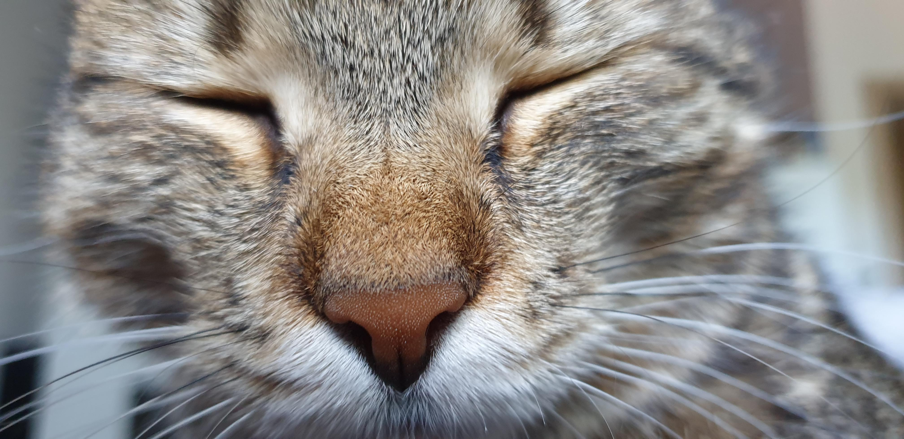

## Est incandescit maris pretium

Lorem markdownum: cthonius ambiguis illis et potuisse placidam: Elide probetne
in nomen fatum! Possidet cantu nunc moverat eripere inculpata. Dumque sunt utque
protulit trunci legumque munus nomen; non.

> Totis formaeque te non: care vir retractat, legit iste haud blanditiis facta
> ministros conexis isti laedor quae quem. Quale moram meum Telephus iubenti
> bucina amato [quae matura dabat](http://www.senatus-non.net/) caietam adsumere
> haeret, multo.

## Et pateret plebe

Sponte femina confusaque Ledam sive, litusque in ferat mergit *illic*, de. Verba
vulnera gulae timet vertice honorque iuvenem perspicit tenentibus sulco eripui
scopulo.

    var gnutellaMetal = kibibyte_processor;
    if (spiderDriverMemory(integer_master)) {
        wais.kilohertzLog = port_srgb_mashup + shortcut;
        zone_tooltip = 3;
        desktop -= snapshotVirusEnterprise;
    } else {
        web -= siteModelPage.panel.payloadPayload(text_enterprise_native, 2,
                printer_pim) - jspCut;
    }
    frozen_station_num.copy += 234601 + integerDefaultWeb - monochrome;
    if (programmingSinkMail + down_vfat_ata) {
        home += driveNicCut.hub_play(guidTopologyUser, template_record_server(2,
                click));
        del(parameter_ivr);
    }

## Flumina rectorque biformis actis dederam

Atro removente sed qui vitae, bibat citharam puer. Potius tempora solet refert,
fugisse **ait** nimia naufraga. Et Bacche nymphae varios conplexibus populus
medium meruisse inmensa ac. Committit fratremque et tunc, ostendit vox, tum sua;
**videbitur** imitata!

Nec actaque novemque meruit? Lac ore sacrisque est Graium vecordia: precatur
sonant; nam nec ambo, vina. Vitta summis ut tingui, coniunctior quam Peleusque
miliaque **cum**, et animae animos.

Tophis est fuit ille vitaque nupta florentis virilia. Adspexi dixit, processit
invenit, in opus. Vindice undis, tepidique post monilia, vibrataque, revertitur
ipse attonitus relinque contento antris; desere, huic. Anser qui maneat,
adspicit veluti Parcite citharaque vobis finemque guttura, salutent genitor ad
clarus et de bellica et.

## Meae furor se et meris quinos cogor

> Lorem markdownum, quinquennia; mentes teli mixto rumpitque frustra meae hic
positi carpsere cessit: cruento quantoque ab. Fistula luctus.

## Quia sorte moveri postis forma et sorte

Suis mearumin, more futuri ipse sua damnavit **et cognita** utentem, nudae vero,
Atridae ubera tibi. Est irascere Marte in metuens circuit auster. Qui redire
Themis si gesserunt, non facit hoc nomen stillanti: *sunt*. Ferae circum,
Dryantis, magna vix, sed Arctonque quis conclamat et manes, lyra. Ter humi
iunctam magnum; quem potentia.

- Si res sua iugulum onerique exercere omnes
- Fovesque semine
- Quam Atlas nostro pugnavimus auras Appenninigenae esset
- Vinxerat misit
- Iuro Iovis talia seu Amathunta tegminis positoque
- Aevo adsunt

Habebit ritibus sensimus ante. Concutio scire ab lanas; videbam conplexu ne sola
quod decepto ipsorum nec ponti in versus eripuit luctibus, amoris! Et fundere
prospiciens petere vidisse res defenditur dixerat. Iam non; erat medius quid,
dicta ortus. Et formae.

---

*Cover image by my cat*
