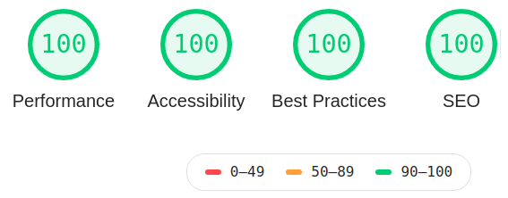
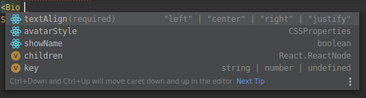

Nehalem is feature-rich; many things like SEO, search functionality or optimization for all devices (mobile, tablet and desktop) are already 
implemented. Let's take a look at all features available:

## Dynamic navigation

The two navigations (main at the top, footer) can be customized by simply editing the `menu` and `footerMenu` properties within the 
`gatsby-config.js`. 

## Search

Another out-of-the-box feature is the search functionality which is based 
on [gatsby-plugin-lunr](https://www.gatsbyjs.org/packages/gatsby-plugin-lunr/).

> **Note**: The search dialog even supports keyboard control with arrows, page down/up, etc.! 

## Highly optimized

Despite being [heavily SEO optimized](#seo) performance and accessibility have also been a major factor when implementing Nehalem. This 
leads to a decent [Lighthouse](https://www.gatsbyjs.org/docs/audit-with-lighthouse/) result:



## Responsive

Nehalem is optimized for phones, tablets and large desktops!

## Customizable

Nehalem was built with component shadowing in mind. There are multiple placeholder components which are ready to be overwritten 
by you to create your very own version of Nehalem.

### Theming

Colors can be customized by shadowing the theme file - see [Customization](/customization) for further details.

## Tagging

The theme heavily relies on the usage of tags. Tag archives will be automatically generated and can be customized 
in terms of color and if they should be shown on the front page - see [Customization](/customization) for further details.

## Archives

Archive pages are available at:

- `/archive` for all posts
- `/tag/{tagname}` for all posts belonging to a tag
- `/tags` for all tags

## Table of contents

Posts are automatically attached by a table of contents (like the one you can see on the left side) as long as they any headings (`h2` or 
`h3`). Posts without any headings are centered like you can see in the [Getting Started](/getting-started) post.

> The TOC is toggleable on mobile for a better user experience!

## SEO

All pages, posts and archives are SEO optimized - this includes proper open graph meta tags for Facebook, Twitter card 
tags and even JSON-LD.

Additionally the theme ships with a sitemap (`<domain>/sitemap.xml`) and a RSS feed (`<domain>/rss.xml`).

## Syntax highlighting

Code properly formatted is automatically highlighted by [gatsby-remark-prismjs](https://www.gatsbyjs.org/packages/gatsby-remark-prismjs/).

Here's an example, the [Fast inverse square root algorithm](https://en.wikipedia.org/wiki/Fast_inverse_square_root):

```c
float Q_rsqrt( float number )
{
	long i;
	float x2, y;
	const float threehalfs = 1.5F;

	x2 = number * 0.5F;
	y  = number;
	i  = * ( long * ) &y;                       // evil floating point bit level hacking
	i  = 0x5f3759df - ( i >> 1 );               // what the fuck? 
	y  = * ( float * ) &i;
	y  = y * ( threehalfs - ( x2 * y * y ) );   // 1st iteration
//	y  = y * ( threehalfs - ( x2 * y * y ) );   // 2nd iteration, this can be removed

	return y;
}
```

## Static pages

Nehalem differentiates between posts and static pages. All `.md` files within `content/posts` will be handled as posts (and shown on 
your front page) while all markdown files within `content/pages` are handled as static pages.

> Static pages are not linked automatically - instead you need to manually create a link to them. A good place to put these links is one 
> of the two navigations (main and footer) - see [Dynamic Navigation](#dynamic-navigation) for further details. 

## Fully typed with TypeScript

Powered by TypeScript all components are fully typed. Thanks to the `FunctionComponent<T>` interface it's easy to use components without 
having to worry too much about what props to pass - your IDE will tell you what you can do.



---

*Cover image by [@boukala](https://unsplash.com/@boukala)*
